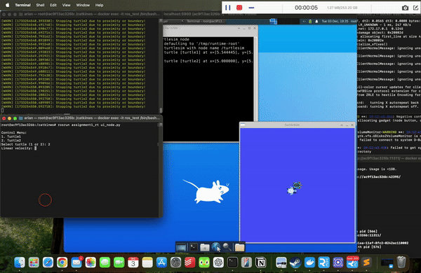

# ROS Assignment 1: Turtle Control and Monitoring

## Introduction
This project implements two ROS nodes in the package assignment1_rt to interact with and monitor turtles in the turtlesim environment. The first node (ui_node.py) provides a text-based interface to control turtle1 or turtle2. It allows users to input linear and angular velocities, which are applied to the selected turtle for one second before stopping.
The second node (distance_node.py) continuously monitors the distance between turtle1 and turtle2 and publishes this value to the /turtles_distance topic. It ensures that turtle2 stops if it gets too close to turtle1 or the simulation's boundaries (x or y exceeding 10 or below 1). Together, these nodes provide a basic system for turtle simulation control and safety monitoring.
## How to run
To run the project, set up a ROS workspace and clone this repository into the src folder. After building the workspace, start the ROS core and run the turtlesim node. Then, execute the ui_node.py (rosrun assignment1_rt ui_node.py) and distance_node.py (rosrun assignment1_rt distance_node.py) scripts using rosrun. The UI node lets you control the turtles, while the distance node automatically enforces safety rules.

## Proof of work

